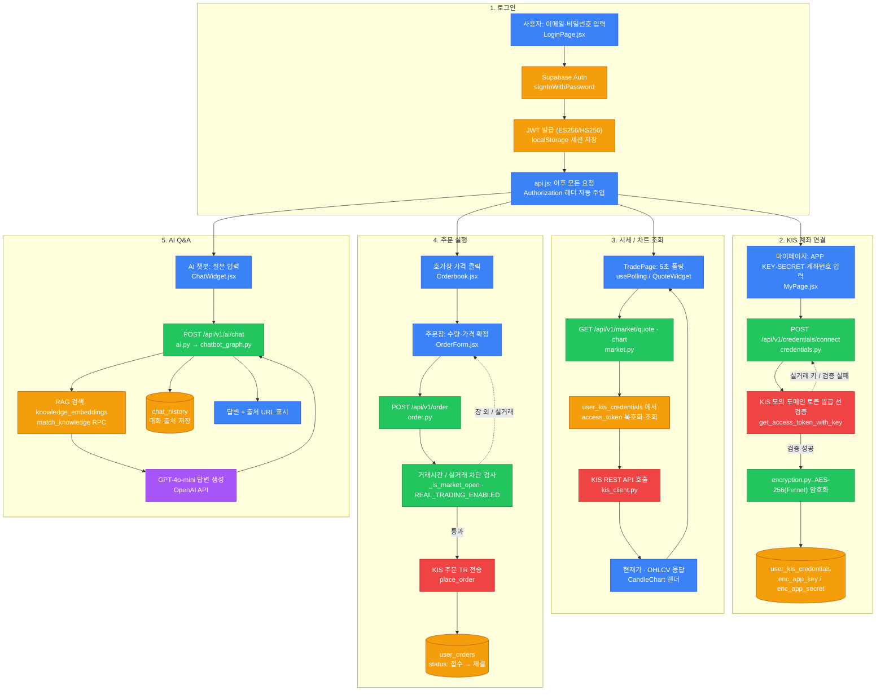

# SafeInvest AI — 시스템 전체 플로우차트

서비스별 색상 구분: **Frontend=파랑 · Backend=초록 · Supabase=주황 · KIS=빨강 · OpenAI=보라**

## 범례

| 색상 | 서비스 | 역할 |
|---|---|---|
| 🔵 파랑 | Frontend (React) | 사용자 UI · 입력 · 렌더링 |
| 🟢 초록 | Backend (FastAPI) | 인증·검증·비즈니스 로직·중계 |
| 🟠 주황 | Supabase | DB · Auth · pgvector · RLS |
| 🔴 빨강 | KIS API | 시세·차트·주문·잔고 (한국투자증권) |
| 🟣 보라 | OpenAI API | 임베딩 · GPT-4o 답변 생성 |
